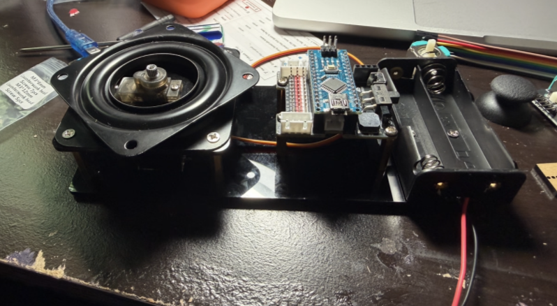
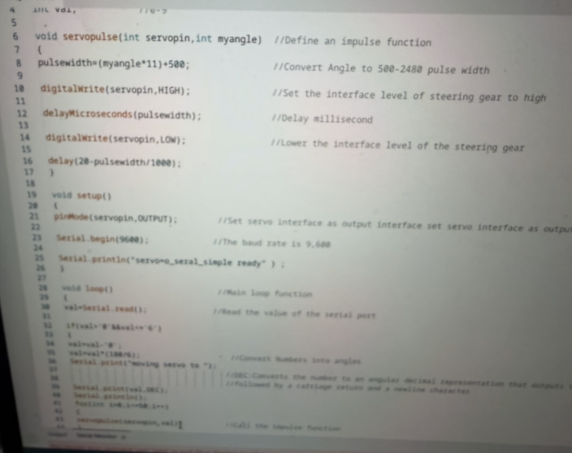
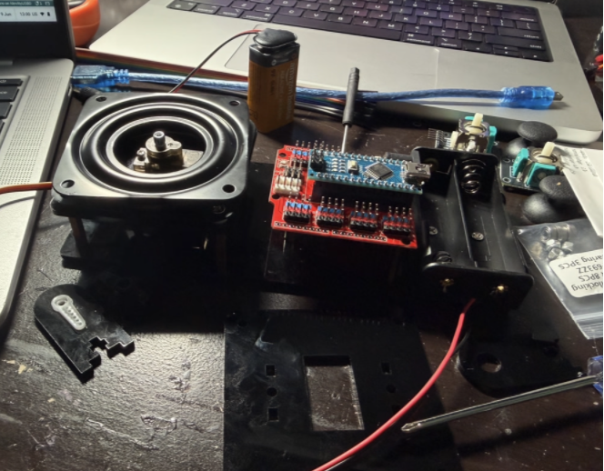
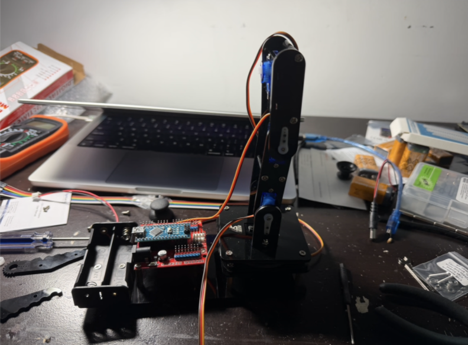
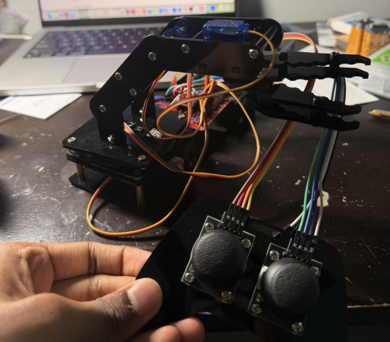
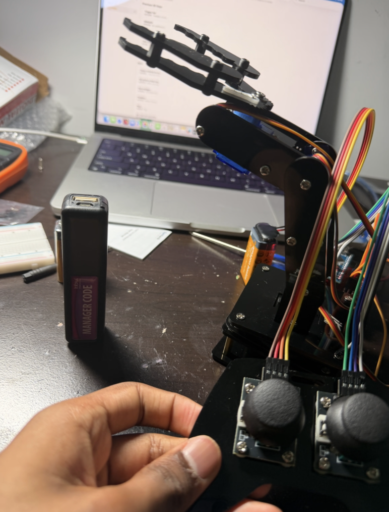
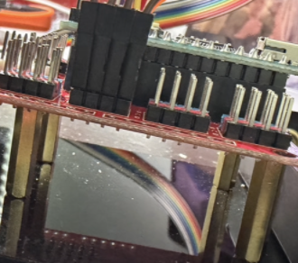
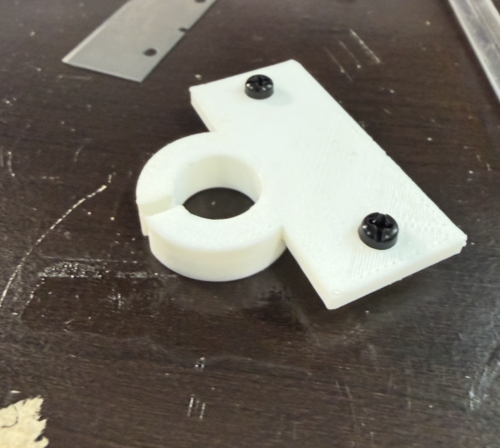

# Robotic Portrait Arm
A 3-jointed robotic arm that draws portraits from webcam input. The arm uses inverse kinematics to translate edge-detected strokes into servo angles, putting pen to paper.
<!---Talk about my three jointed arm, and talk about biggest challenges+modifications]--->

| **Engineer** | **School** | **Area of Interest** | **Grade** |
|:--:|:--:|:--:|:--:|
| Jotin S | Adlai E. Stevenson High School | Computer Engineering | Incoming Sophomore

**Replace the BlueStamp logo below with an image of yourself and your completed project. Follow the guide [here](https://tomcam.github.io/least-github-pages/adding-images-github-pages-site.html) if you need help.**


  
# Final Milestone

**Don't forget to replace the text below with the embedding for your milestone video. Go to Youtube, click Share -> Embed, and copy and paste the code to replace what's below.**

<iframe width="560" height="315" src="https://www.youtube.com/embed/F7M7imOVGug" title="YouTube video player" frameborder="0" allow="accelerometer; autoplay; clipboard-write; encrypted-media; gyroscope; picture-in-picture; web-share" allowfullscreen></iframe>

Modification milestone adding the portrait-drawing CV pipeline on top of the base arm.


# Second Milestone

**Don't forget to replace the text below with the embedding for your milestone video. Go to Youtube, click Share -> Embed, and copy and paste the code to replace what's below.**

<iframe width="560" height="315" src="https://www.youtube.com/embed/y3VAmNlER5Y" title="YouTube video player" frameborder="0" allow="accelerometer; autoplay; clipboard-write; encrypted-media; gyroscope; picture-in-picture; web-share" allowfullscreen></iframe>

Getting to start coding writing the servo control logic and beginning the software side of the project.

# First Milestone

**Don't forget to replace the text below with the embedding for your milestone video. Go to Youtube, click Share -> Embed, and copy and paste the code to replace what's below.**

<iframe width="560" height="315" src="https://www.youtube.com/embed/Bran1-3o-d0?si=Z8JfRbtlbdPhubwd" title="YouTube video player" frameborder="0" allow="accelerometer; autoplay; clipboard-write; encrypted-media; gyroscope; picture-in-picture; web-share" referrerpolicy="strict-origin-when-cross-origin" allowfullscreen></iframe>

Rotating servos 90 degrees and getting the entire structure fully assembled and wired.

# Build Progress

**Day 1**



Set up the nano board and shield for my base, also connected my servo into it along with battery case. Went to building because I do not have the right port in my computer to get arduino set up and connected.

**Day 2**



Created program to rotate servos to what ever value is preferenced. For me I did 90 degrees.



Replaced the nano shield after I realized the original one didnt have battery installed, as I needed more power.

**Day 3**



Continued building; the arm structure is forming now.

**Day 4**



Finished the arm and connected the wiring for the entire structure. Wrote arm code to control the servos via dual joystick.



Finished the arm and connected the wiring for the entire structure. Wrote arm code to control the servos via dual joystick.



The fried nano shield is not very visible here, but I burned it out and had to replace it with a new one.

**Day 6–7**



Iteration 1 of the 3D printed Sharpie pen holder. The screw holes were not threaded, which made it difficult to secure the clamp to the claw. The clamp was also too short to grip the Sharpie properly. For iteration 2, the plan is to make the clamp longer, add threaded screw holes, and tighten the Sharpie hole diameter for a more secure fit.

# Schematics 
Here's where you'll put images of your schematics. [Tinkercad](https://www.tinkercad.com/blog/official-guide-to-tinkercad-circuits) and [Fritzing](https://fritzing.org/learning/) are both great resoruces to create professional schematic diagrams, though BSE recommends Tinkercad becuase it can be done easily and for free in the browser. 

# Code

## Joystick Arm Control

Dual-joystick controller for the full arm — left joystick controls vertical and horizontal rotation, right joystick controls the claw. Supports capture and playback of action sequences via the right joystick Y-axis. A buzzer confirms each stored action.

```c++
#include "CokoinoArm.h"

// ── Pin Configuration ────────────────────────────────────────────────────────
#define BUZZER_PIN      9
#define SERVO_BASE      4
#define SERVO_SHOULDER  5
#define SERVO_ELBOW     6
#define SERVO_CLAW      7
#define JOY_XL          A0
#define JOY_YL          A1
#define JOY_XR          A2
#define JOY_YR          A3

// ── Action Buffer ────────────────────────────────────────────────────────────
static const uint8_t ACT_MAX = 10;
int act[ACT_MAX][4];
int num    = 0;
int num_do = 0;

CokoinoArm arm;
int xL, yL, xR, yR;

void date_processing(int *x, int *y) {
  if (abs(512 - *x) > abs(512 - *y))  *y = 512;
  else                                  *x = 512;
}

// ── Vertical Control  (Left Joystick X-axis) ────────────────────────────────
void turnUD(void) {
  if (xL == 512) return;
  if      (xL >=   0 && xL <= 100) { arm.up(10);   return; }
  if      (xL >  100 && xL <= 200) { arm.up(20);   return; }
  if      (xL >  200 && xL <= 300) { arm.up(25);   return; }
  if      (xL >  300 && xL <= 400) { arm.up(30);   return; }
  if      (xL >  400 && xL <= 480) { arm.up(35);   return; }
  if      (xL >  540 && xL <= 600) { arm.down(35); return; }
  if      (xL >  600 && xL <= 700) { arm.down(30); return; }
  if      (xL >  700 && xL <= 800) { arm.down(25); return; }
  if      (xL >  800 && xL <= 900) { arm.down(20); return; }
  if      (xL >  900)              { arm.down(10); return; }
}

// ── Horizontal Control  (Left Joystick Y-axis) ───────────────────────────────
void turnLR(void) {
  if (yL == 512) return;
  if      (yL >=   0 && yL <= 100) { arm.right(0);  return; }
  if      (yL >  100 && yL <= 200) { arm.right(5);  return; }
  if      (yL >  200 && yL <= 300) { arm.right(10); return; }
  if      (yL >  300 && yL <= 400) { arm.right(15); return; }
  if      (yL >  400 && yL <= 480) { arm.right(20); return; }
  if      (yL >  540 && yL <= 600) { arm.left(20);  return; }
  if      (yL >  600 && yL <= 700) { arm.left(15);  return; }
  if      (yL >  700 && yL <= 800) { arm.left(10);  return; }
  if      (yL >  800 && yL <= 900) { arm.left(5);   return; }
  if      (yL >  900)              { arm.left(0);   return; }
}

// ── Claw Control  (Right Joystick X-axis) ───────────────────────────────────
void turnCO(void) {
  if (xR == 512) return;
  if      (xR >=   0 && xR <= 100) { arm.close(0);  return; }
  if      (xR >  100 && xR <= 200) { arm.close(5);  return; }
  if      (xR >  200 && xR <= 300) { arm.close(10); return; }
  if      (xR >  300 && xR <= 400) { arm.close(15); return; }
  if      (xR >  400 && xR <= 480) { arm.close(20); return; }
  if      (xR >  540 && xR <= 600) { arm.open(20);  return; }
  if      (xR >  600 && xR <= 700) { arm.open(15);  return; }
  if      (xR >  700 && xR <= 800) { arm.open(10);  return; }
  if      (xR >  800 && xR <= 900) { arm.open(5);   return; }
  if      (xR >  900)              { arm.open(0);   return; }
}

void buzzer(int H, int L) {
  while (yR < 420) {
    digitalWrite(BUZZER_PIN, HIGH); delayMicroseconds(H);
    digitalWrite(BUZZER_PIN, LOW);  delayMicroseconds(L);
    yR = arm.JoyStickR.read_y();
  }
  while (yR > 600) {
    digitalWrite(BUZZER_PIN, HIGH); delayMicroseconds(H);
    digitalWrite(BUZZER_PIN, LOW);  delayMicroseconds(L);
    yR = arm.JoyStickR.read_y();
  }
}

void C_action(void) {
  if (yR <= 800) return;
  int *p = arm.captureAction();
  for (uint8_t i = 0; i < 4; i++) { act[num][i] = *p++; }
  num_do = ++num;
  if (num >= ACT_MAX) { num = 0; buzzer(600, 400); }
  while (yR > 600) { yR = arm.JoyStickR.read_y(); }
}

void Do_action(void) {
  if (yR >= 220) return;
  buzzer(200, 300);
  for (int i = 0; i < num_do; i++) { arm.do_action(act[i], 15); }
  num = 0;
  while (yR < 420) { yR = arm.JoyStickR.read_y(); }
  for (int i = 0; i < 2000; i++) {
    digitalWrite(BUZZER_PIN, HIGH); delayMicroseconds(200);
    digitalWrite(BUZZER_PIN, LOW);  delayMicroseconds(300);
  }
}

void setup() {
  arm.ServoAttach(SERVO_BASE, SERVO_SHOULDER, SERVO_ELBOW, SERVO_CLAW);
  arm.JoyStickAttach(JOY_XL, JOY_YL, JOY_XR, JOY_YR);
  pinMode(BUZZER_PIN, OUTPUT);
}

void loop() {
  xL = arm.JoyStickL.read_x();
  yL = arm.JoyStickL.read_y();
  xR = arm.JoyStickR.read_x();
  yR = arm.JoyStickR.read_y();
  date_processing(&xL, &yL);
  date_processing(&xR, &yR);
  turnUD();
  turnLR();
  turnCO();
  C_action();
  Do_action();
}
```

## Inverse Kinematics — Autonomous Arm Control (Python)

Takes a target (x, y, z) coordinate in cm, calculates the required base, shoulder, and elbow servo angles using 2-link IK math, and sends them to the Arduino over serial. This is the foundation of the portrait-drawing modification.

```python
import numpy as np
import serial
import time

# ── Link lengths (measure and update these) ──────────────────────────────────
L1 = 10.0  # shoulder to elbow (cm)
L2 = 10.0  # elbow to pen tip (cm)

# ── Serial connection to Arduino ─────────────────────────────────────────────
ser = serial.Serial('/dev/tty.usbserial-XXXX', 9600)  # update port
time.sleep(2)

# ── Inverse Kinematics ───────────────────────────────────────────────────────
def ik(x, y, z):
    base = np.degrees(np.arctan2(y, x))
    r = np.sqrt(x**2 + y**2)
    D = (r**2 + z**2 - L1**2 - L2**2) / (2 * L1 * L2)
    if abs(D) > 1:
        return None
    elbow    = np.degrees(np.arctan2(-np.sqrt(1 - D**2), D))
    shoulder = np.degrees(np.arctan2(z, r) - np.arctan2(L2 * np.sin(np.radians(elbow)), L1 + L2 * np.cos(np.radians(elbow))))
    base     = max(0, min(180, base))
    shoulder = max(0, min(180, shoulder))
    elbow    = max(0, min(180, elbow + 90))
    return int(base), int(shoulder), int(elbow)

# ── Send angles to Arduino ───────────────────────────────────────────────────
def move_to(x, y, z):
    angles = ik(x, y, z)
    if angles is None:
        print(f"Point ({x},{y},{z}) out of reach")
        return
    base, shoulder, elbow = angles
    ser.write(f"{base},{shoulder},{elbow}\n".encode())
    time.sleep(0.5)

# ── Test move ────────────────────────────────────────────────────────────────
if __name__ == "__main__":
    move_to(10, 0, 5)
    move_to(8,  4, 5)
    move_to(0,  0, 10)
```

## Arduino Serial Receiver

Receives base, shoulder, and elbow angles from the Python IK solver over serial and moves the servos accordingly.

```c++
#include <Servo.h>

Servo base, shoulder, elbow;

void setup() {
  Serial.begin(9600);
  base.attach(4);
  shoulder.attach(5);
  elbow.attach(6);
}

void loop() {
  if (Serial.available()) {
    String cmd = Serial.readStringUntil('\n');
    int b = cmd.substring(0, cmd.indexOf(',')).toInt();
    cmd = cmd.substring(cmd.indexOf(',') + 1);
    int s = cmd.substring(0, cmd.indexOf(',')).toInt();
    int e = cmd.substring(cmd.indexOf(',') + 1).toInt();
    base.write(b);
    shoulder.write(s);
    elbow.write(e);
  }
}
```

## 3D Print Code in OpenSCAD

**Iteration 1** — Initial pen holder design. 13.1mm Sharpie hole, 30mm clamp length, basic M3 mounting holes with no threading and no counterbore.

```openscad
// Sharpie Fine Point Holder for Robot Arm
// Units: millimeters

$fn = 96;

// ---------- Sharpie clamp ----------
sharpie_hole_d = 13.1;      // Sharpie body hole
clamp_outer_d  = 24;        // outside diameter of holder
clamp_len      = 30;        // height of holder
slit_w         = 2.5;       // slit so holder can flex/grip

// ---------- Mounting plate ----------
mount_hole_spacing = 36;    // center-to-center spacing
mount_hole_d       = 3.4;   // M3 clearance hole
mount_plate_w      = 48;    // plate width
mount_plate_d      = 22;    // plate depth
mount_plate_t      = 3;     // plate thickness for M3x5mm screws
mount_overlap      = 7;     // overlap into clamp for strength

// ---------- Derived ----------
r_outer = clamp_outer_d / 2;
r_pen   = sharpie_hole_d / 2;
mount_plate_y = -r_outer - mount_plate_d/2 + mount_overlap;

difference() {
    union() {
        cylinder(d = clamp_outer_d, h = clamp_len);
        translate([0, mount_plate_y, mount_plate_t/2])
            cube([mount_plate_w, mount_plate_d, mount_plate_t], center = true);
    }
    translate([0, 0, -1])
        cylinder(d = sharpie_hole_d, h = clamp_len + 2);
    translate([-slit_w/2, r_pen, -1])
        cube([slit_w, r_outer - r_pen + 4, clamp_len + 2]);
    for (x = [-mount_hole_spacing/2, mount_hole_spacing/2]) {
        translate([x, mount_plate_y, -1])
            cylinder(d = mount_hole_d, h = mount_plate_t + 2);
    }
}
```

**Iteration 2** — Fixed the issues from iteration 1. Smaller 12.6mm hole for a tighter grip, longer 42mm clamp for better Sharpie retention, and M3 screw head counterbores so screws sit flush and threads reach properly.

```openscad
// Sharpie Fine Point Holder for Robot Arm - Revised Version
// Units: millimeters

$fn = 96;

// ---------- Sharpie clamp ----------
sharpie_hole_d = 12.6;      // smaller because 13.1mm was too loose
clamp_outer_d  = 24;        // outside diameter of holder
clamp_len      = 42;        // longer/deeper Sharpie grip
slit_w         = 2.5;       // slit so holder can flex/grip

// ---------- Mounting plate ----------
mount_hole_spacing = 36;    // center-to-center spacing
mount_hole_d       = 3.4;   // KEEP SAME: M3 screw fit was perfect
mount_plate_w      = 48;    // plate width
mount_plate_d      = 22;    // plate depth
mount_plate_t      = 3;     // thick enough to print properly
mount_overlap      = 7;     // overlap into clamp for strength

// ---------- Screw head recess ----------
screw_head_recess_d     = 6.2;  // recess for M3 screw head
screw_head_recess_depth = 1.2;  // lets screw sit lower so threads reach better

// ---------- Derived ----------
r_outer = clamp_outer_d / 2;
r_pen   = sharpie_hole_d / 2;
mount_plate_y = -r_outer - mount_plate_d/2 + mount_overlap;

difference() {
    union() {
        cylinder(d = clamp_outer_d, h = clamp_len);
        translate([0, mount_plate_y, mount_plate_t/2])
            cube([mount_plate_w, mount_plate_d, mount_plate_t], center = true);
    }
    translate([0, 0, -1])
        cylinder(d = sharpie_hole_d, h = clamp_len + 2);
    translate([-slit_w/2, r_pen, -1])
        cube([slit_w, r_outer - r_pen + 4, clamp_len + 2]);
    for (x = [-mount_hole_spacing/2, mount_hole_spacing/2]) {
        translate([x, mount_plate_y, -1])
            cylinder(d = mount_hole_d, h = mount_plate_t + 2);
    }
    for (x = [-mount_hole_spacing/2, mount_hole_spacing/2]) {
        translate([x, mount_plate_y, mount_plate_t - screw_head_recess_depth])
            cylinder(d = screw_head_recess_d, h = screw_head_recess_depth + 1);
    }
}
```

## Adjust Servo Rotation Angle

Reads a digit (1 to 6) from the serial monitor and maps it to a servo angle in 30 degree increments (30, 60, 90, 120, 150, 180). Sends the corresponding PWM pulse 50 times to hold the position.

```c++
int servopin = 10;  // servo signal line on digital pin 10
int myangle;        // angle variable (0 to 180)
int pulsewidth;     // pulse width variable
int val;            // serial input digit (1 to 6)

void servopulse(int servopin, int myangle) {
  pulsewidth = (myangle * 11) + 500;
  digitalWrite(servopin, HIGH);
  delayMicroseconds(pulsewidth);
  digitalWrite(servopin, LOW);
  delay(20 - pulsewidth / 1000);
}

void setup() {
  pinMode(servopin, OUTPUT);
  Serial.begin(9600);
  Serial.println("servo=o_seral_simple ready");
}

void loop() {
  val = Serial.read();

  if (val > '0' && val <= '6') {
    val = val - '0';
    val = val * 30;

    Serial.print("moving servo to ");
    Serial.print(val, DEC);
    Serial.println();

    for (int i = 0; i <= 50; i++) {
      servopulse(servopin, val);
    }
  }
}
```

# Bill of Materials
Here's where you'll list the parts in your project. To add more rows, just copy and paste the example rows below.
Don't forget to place the link of where to buy each component inside the quotation marks in the corresponding row after href =. Follow the guide [here]([url](https://www.markdownguide.org/extended-syntax/)) to learn how to customize this to your project needs. 

| **Part** | **Note** | **Price** | **Link** |
|:--:|:--:|:--:|:--:|
| Item Name | What the item is used for | $Price | <a href="https://www.amazon.com/Arduino-A000066-ARDUINO-UNO-R3/dp/B008GRTSV6/"> Link </a> |
| Item Name | What the item is used for | $Price | <a href="https://www.amazon.com/Arduino-A000066-ARDUINO-UNO-R3/dp/B008GRTSV6/"> Link </a> |
| Item Name | What the item is used for | $Price | <a href="https://www.amazon.com/Arduino-A000066-ARDUINO-UNO-R3/dp/B008GRTSV6/"> Link </a> |

# Other Resources/Examples
One of the best parts about Github is that you can view how other people set up their own work. Here are some past BSE portfolios that are awesome examples. You can view how they set up their portfolio, and you can view their index.md files to understand how they implemented different portfolio components.
- [Example 1](https://trashytuber.github.io/YimingJiaBlueStamp/)
- [Example 2](https://sviatil0.github.io/Sviatoslav_BSE/)
- [Example 3](https://arneshkumar.github.io/arneshbluestamp/)

To watch the BSE tutorial on how to create a portfolio, click here.
